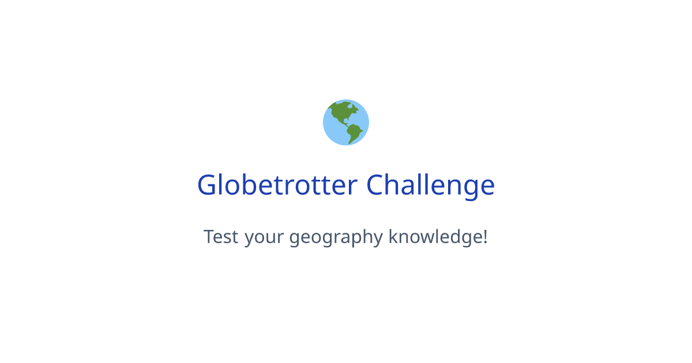

# Globetrotter

Globetrotter is an interactive geography quiz game that challenges players to identify cities and countries around the world based on clues. Test your knowledge, learn interesting facts, and challenge your friends to beat your score!



## Features

- **Geography Quiz Game**: Guess destinations based on clues and hints
- **Score Tracking**: Keep track of your correct and incorrect answers
- **Challenge Mode**: Challenge friends to beat your score
- **Fun Facts**: Learn interesting trivia about each destination
- **Confetti Celebration**: Visual celebration when you get an answer right
- **Responsive Design**: Play on any device with a beautiful UI
- **Dark Mode Support**: Comfortable gameplay day or night

## Tech Stack

- **Framework**: [Next.js](https://nextjs.org/) (App Router)
- **Styling**: [Tailwind CSS](https://tailwindcss.com/)
- **UI Components**: [Radix UI](https://www.radix-ui.com/) with shadcn/ui
- **State Management**: React Hooks
- **Animations**: React Confetti
- **Deployment**: Vercel (recommended)

## Getting Started

### Prerequisites

- Node.js 18.x or later
- npm, yarn, or pnpm

### Installation

1. Clone the repository:
   ```bash
   git clone https://github.com/PritishMishraa/globetrotter.git
   cd globetrotter
   ```

2. Install dependencies:
   ```bash
   npm install
   # or
   yarn
   # or
   pnpm install
   ```

3. Start the development server:
   ```bash
   npm run dev
   # or
   yarn dev
   # or
   pnpm dev
   ```

4. Open [http://localhost:3000](http://localhost:3000) in your browser to see the application.

## How to Play

1. When you start the game, you'll be presented with clues about a destination.
2. Choose from the multiple-choice options to guess the correct destination.
3. After selecting an answer, you'll receive immediate feedback and learn a fun fact about the destination.
4. Continue playing to improve your score and knowledge.
5. Challenge friends by sharing your score with them.

## Customization

The game data is stored in `data.json`. You can add more destinations by following the existing format:

```json
{
  "id": number,
  "city": "City Name",
  "country": "Country Name",
  "clues": ["Clue 1", "Clue 2"],
  "fun_fact": ["Fun fact about the destination"],
  "trivia": ["Additional trivia"]
}
```

## Deployment

The easiest way to deploy Globetrotter is using [Vercel](https://vercel.com):

1. Push your code to a GitHub repository.
2. Import the project into Vercel.
3. Vercel will detect Next.js and set up the build configuration automatically.
4. Your application will be deployed and available at a Vercel URL.

## Contributing

Contributions are welcome! Please feel free to submit a Pull Request.

## License

This project is licensed under the MIT License - see the [LICENSE](LICENSE) file for details.

## Acknowledgements

- Geography data compiled using ChatGPT
- UI components from [shadcn/ui](https://ui.shadcn.com/)
- Next.js team for the amazing framework
- Cursor for writing ALL the code
